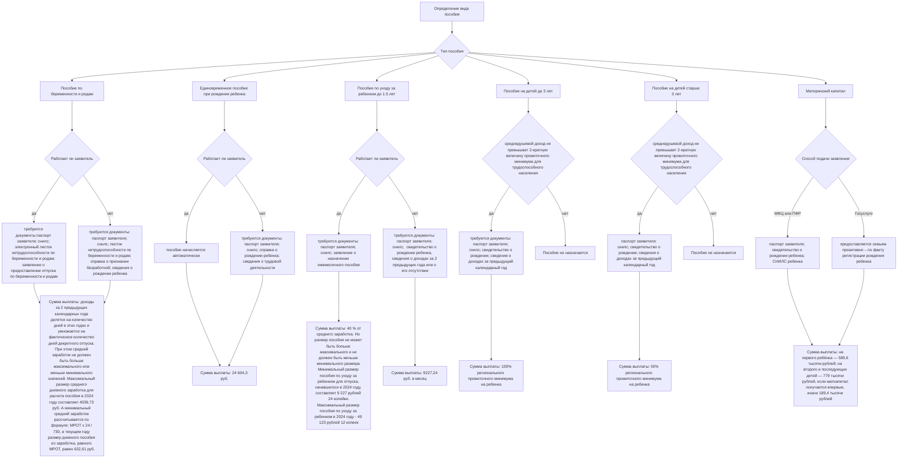

```mermaid
graph TD
    A[Определение вида пособия] --> B{Тип пособия}
    B --> B1[Пособие по беременности и родам]
    B --> B2[Единовременное пособие при рождении ребенка]
    B --> B3[Пособие по уходу за ребенком до 1.5 лет]
    B --> B4[Пособие на детей до 3 лет]
    B --> B5[Пособие на детей старше 3 лет]
    B --> B6[Материнский капитал]
    B6 --> C{Способ подачи заявления}
    C -->|МФЦ или ПФР| C6[паспорт заявителя; свидетельство о рождении ребенка; СНИЛС ребенка]
    C -->|Госуслуги| C7[предоставляется семьям проактивно – по факту регистрации рождения ребенка]
    C6 --> C9
    C7 --> C9[Сумма выплаты: на первого ребёнка — 589,6 тысячи рублей; на второго и последующих детей — 779 тысячи рублей, если маткапитал получается впервые, иначе 189,4 тысячи рублей]
    B2 --> C2{Работает ли заявитель}
    C2 -->|да| C21[пособие начисляется автоматически]
    C2 -->|нет| C22[требуются документы: паспорт заявителя; снилс; справка о рождении ребенка; сведения о трудовой деятельности]
    C22 --> C23[Сумма выплаты: 24 604,3 руб.]
    C21 --> C23
    B1 --> C1{Работает ли заявитель}
    C1 -->|да| C11[требуются документы:паспорт заявителя; снилс; электронный листок нетрудоспособности по беременности и родам; заявление о предоставлении отпуска по беременности и родам]
    C1 -->|нет| C12[требуются документы: паспорт заявителя; снилс; листок нетрудоспособности по беременности и родам; справка о признании безработной; сведения о рождении ребенка]
    C12 --> C13[Cумма выплаты: доходы за 2 предыдущих календарных года делятся на количество дней в этих годах и умножается на фактическое количество дней декретного отпуска. При этом средний заработок не должен быть больше максимального или меньше минимального значений. Максимальный размер среднего дневного заработка для расчета пособия в 2024 году составляет 4039,73 руб. А минимальный средний заработок рассчитывается по формуле: МРОТ х 24 / 730, в текущем году размер дневного пособия из заработка, равного МРОТ, равен 632,61 руб. ]
    C11 --> C13
    B3 --> C3{Работает ли заявитель}
    C3 -->|да| C31[требуются документы: паспорт заявителя; снилс; заявление о назначении ежемесячного пособия]
    C3 -->|нет| C32[требуются документы: паспорт заявителя; снилс;  свидетельство о рождении ребенка, сведения о доходах за 2 предыдущих года или о его отсутствии]
    C31 --> C311[Cумма выплаты: 40 % от среднего заработка. Но размер пособия не может быть больше максимального и не должен быть меньше минимального размера.
Минимальный размер пособия по уходу за ребенком для отпуска, начавшегося в 2024 году, составляет 9 227 рублей 24 копейки.
Максимальный размер пособия по уходу за ребенком в 2024 году - 49 123 рублей 12 копеек]
    C32 --> C312[Сумма выплаты: 9227,24 руб. в месяц]
    B4 --> C4{среднедушевой доход не превышает 2-кратную величину прожиточного минимума для трудоспособного населения}
    C4 -->|да| C41[требуются документы: паспорт заявителя; снилс; свидетельство о рождении; сведения о доходах за предыдущий календарный год]
    C4 -->|нет| C42[Пособие не назначается]
    C41 --> C441[Сумма выплаты: 100% регионального прожиточного минимума на ребенка]
    B5 --> C5{среднедушевой доход не превышает 2-кратную величину прожиточного минимума для трудоспособного населения}
    C5 -->|да| C51[паспорт заявителя; снилс; свидетельство о рождении; сведения о доходах за предыдущий календарный год]
    C5 -->|нет| C52[Пособие не назначается]
    C51 --> C551[Сумма выплаты: 50% регионального прожиточного минимума на ребенка]
```
